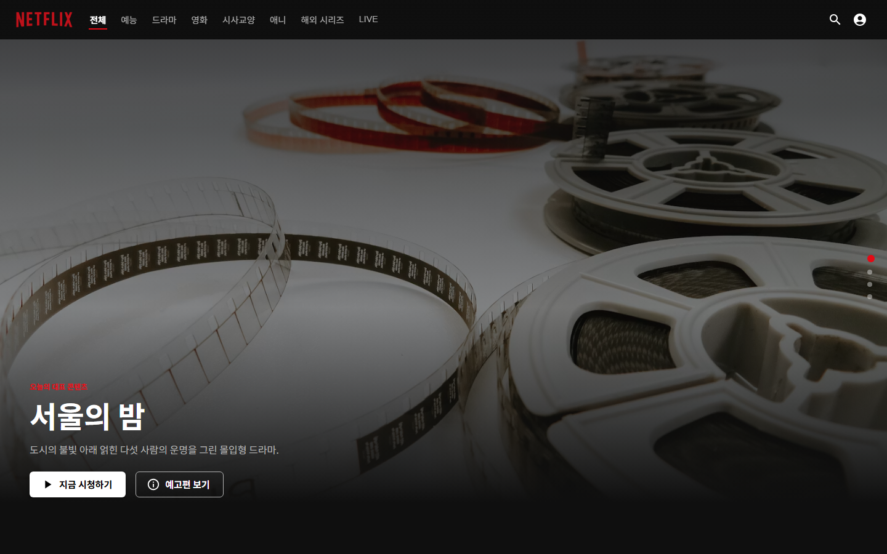
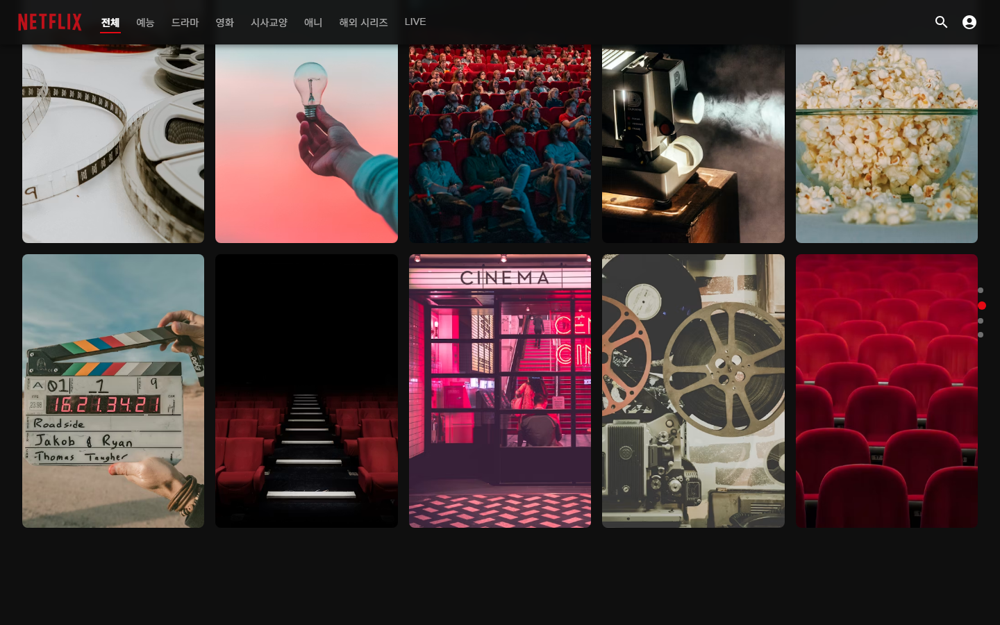
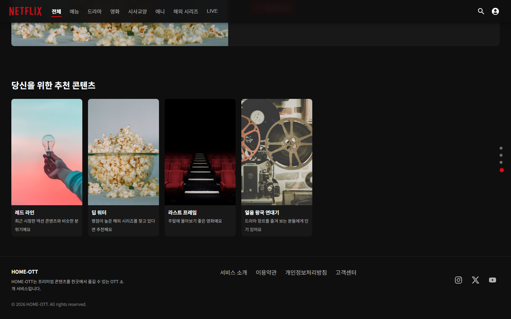
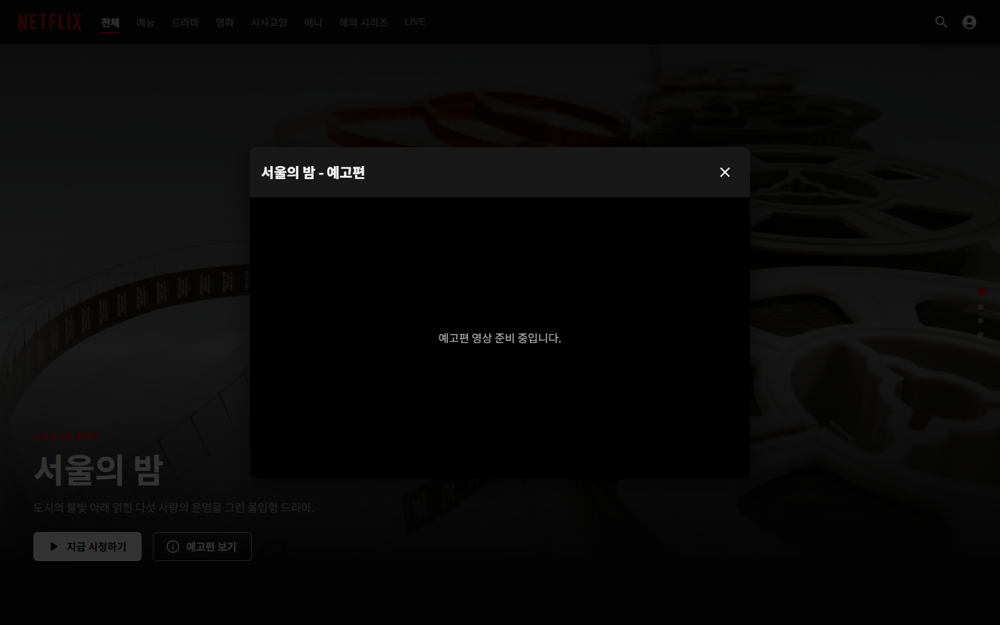
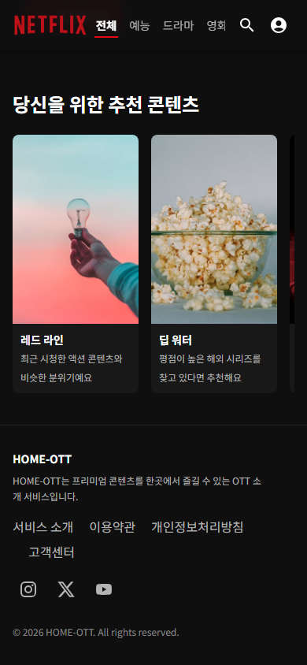

# HOME-OTT 테스트 리포트

## 1. 프로젝트 개요

| 항목 | 내용 |
|---|---|
| 프로젝트명 | HOME-OTT (home-ott) |
| 목적 | OTT 서비스 콘텐츠 소개 랜딩페이지 |
| 기술 스택 | React 18 + Vite 5, MUI(Material UI), React Router, Supabase JS SDK |
| 데이터베이스 | Supabase (PostgreSQL) - `contents`, `recommendations` 테이블, RLS Public Read |
| 배포 | GitHub Actions → GitHub Pages |
| 저장소 | https://github.com/harube29-lang/home-ott |

### 페이지 / 라우트 구성
- `/` : 메인 랜딩페이지 (Hero → 주요 콘텐츠 → 상세 소개 → 추천 콘텐츠)
- `/about` : 서비스 소개
- `/terms` : 이용약관
- `/privacy` : 개인정보처리방침
- `/support` : 고객센터
- `/mypage` : 마이페이지(placeholder)
- `*` : 404 페이지

## 2. 구현 화면 캡처

### Desktop (1440px)
| Hero | 주요 콘텐츠 |
|---|---|
|  |  |

| 상세 소개 / 추천 콘텐츠 | Footer |
|---|---|
|  |  |

예고편 모달 (버튼 클릭으로 오픈, ESC/외부 클릭으로 닫힘):

### Tablet (900px, 3열 그리드)
| Hero | 주요 콘텐츠 |
|---|---|
|  |  |

### Mobile (390px, 2열 그리드)
| Hero | 주요 콘텐츠 | Footer |
|---|---|---|
|  |  |  |

## 3. 테스트 전 발견된 문제점

Playwright(Headless Chromium)로 개발 서버를 직접 구동해 콘솔 로그와 화면을 점검하는 과정에서 아래 문제를 발견했다.

1. **React DOM 경고 (Console Error)**: MUI `Stack`에 `alignItems` / `flexWrap` / `justifyContent`를 JSX prop으로 직접 전달하면 `Stack` 내부 구현이 이를 DOM에 그대로 흘려보내 `React does not recognize the alignitems/flexwrap/justifycontent prop` 경고가 발생 (Header, Hero, FeaturedBanner, Footer 4개 컴포넌트).
2. **ESLint 오류 다수**: `react/prop-types` 규칙이 활성화되어 있었으나 프로젝트에서 `prop-types` 패키지를 사용하지 않아 모든 컴포넌트에서 43건의 오류 발생.
3. **ESLint 오류**: `TermsPage.jsx`에서 텍스트 내 `"` 문자를 그대로 사용해 `react/no-unescaped-entities` 오류 발생.
4. **모바일 Footer 줄바꿈 깨짐**: 390px 폭에서 푸터 메뉴(서비스 소개/이용약관/개인정보처리방침/고객센터)가 `Stack`의 기본 폭 분배 때문에 단어 중간에서 줄바꿈됨.

## 4. 수정 내용

1. `alignItems`/`flexWrap`/`justifyContent`를 모두 `sx` prop으로 이동 (`Header.jsx`, `Hero.jsx`, `FeaturedBanner.jsx`, `Footer.jsx`).
2. 프로젝트가 `prop-types` 패키지를 사용하지 않는 점을 반영해 `eslint.config.js`에서 `react/prop-types` 규칙을 비활성화.
3. `TermsPage.jsx`의 `"서비스"` 표기를 `&ldquo;서비스&rdquo;`로 교체.
4. `Footer.jsx`의 메뉴 `Stack`에 `flexWrap: 'wrap'`, `rowGap`, `'& a': { whiteSpace: 'nowrap' }`을 추가해 좁은 화면에서도 메뉴 텍스트가 깨지지 않도록 수정.
5. `react-refresh/only-export-components` 경고를 줄이기 위해 `GENRES` 상수를 `OttFilterContext.jsx`에서 별도 파일(`src/data/genres.js`)로 분리.

## 5. 수정 후 결과

- `npm run build` : **에러 0건**으로 통과 (청크 크기 경고만 존재, 빌드 실패 아님).
- `npx eslint .` : **에러 0건**, 경고 1건(`useOttFilter` 훅을 Provider와 같은 파일에서 export하는 것에 대한 fast-refresh 권장 경고, 기능에는 영향 없음).
- Playwright Headless Chromium으로 페이지 전체를 순회하며 수집한 `console --errors` 결과: **0건**.
- 모바일 푸터 메뉴 줄바꿈 정상화 확인 (위 스크린샷 참고).

## 6. 반응형 테스트 결과

| 브레이크포인트 | 화면폭 | 콘텐츠 그리드 | 결과 |
|---|---|---|---|
| Desktop | 1440px (≥1200px) | 5열 | 정상 |
| Tablet | 900px (768~1199px) | 3열 | 정상 |
| Mobile | 390px (≤767px) | 2열 | 정상 |

- Header 중앙 메뉴는 좁은 화면에서 가로 스크롤로 전환되어 잘림 없이 모든 장르에 접근 가능.
- 추천 콘텐츠 가로 스크롤 영역은 모든 해상도에서 스냅 스크롤 동작.
- Hero/CTA 버튼은 모바일에서 줄바꿈되며 터치 영역을 유지.

## 7. 최종 점검 체크리스트

- [x] React + Vite 사용
- [x] Supabase MCP로 테이블 생성 (`contents`, `recommendations`)
- [x] 백엔드 서버 없이 Supabase JS SDK로 프론트엔드 직접 연결
- [x] RLS 활성화 + Public Read 정책
- [x] 최소 10개 콘텐츠 시드 데이터 등록
- [x] HTML/CSS/JS 역할 분리 (`src/css/style.css`, `src/js/main.js`, React 컴포넌트)
- [x] 반응형 (Desktop 5열 / Tablet 3열 / Mobile 2열)
- [x] 인터랙션 4종 (카드 Hover, 예고편 모달, Scroll Fade-up, Navigation Active)
- [x] 접근성 (semantic HTML, aria-label, alt, 포커스 상태)
- [x] Footer Dead Link 없음 (전부 실제 라우트/외부 링크)
- [x] `npm run build` 에러 0건
- [x] Console Error 0건 (Playwright 헤드리스 크로미움으로 확인)
- [x] GitHub Actions 워크플로우 작성 (`main` push → install → build → Pages 배포)
- [ ] GitHub Pages 최종 배포 및 URL 확인 (커밋/푸시 단계에서 확인)
